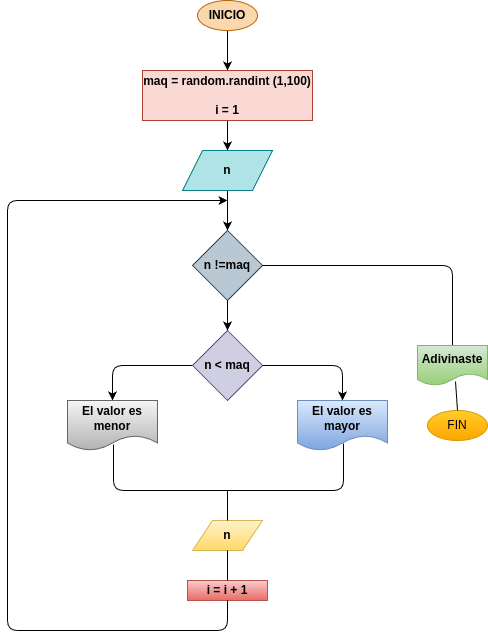

# while_3
Este es un simple juego en elque el usuario debe adivinar un numero aletorio generado por la computadora. El juego proporciona pistas para guiar a el usuario hastaque logre adivinar el numero correctamente.

## intput

### variable de entrada
n: numero que se desea ingresar 
### processing
maq: La computaroda genera un numero aleatori entre 1  y 100.

i: lleva el control de la cantidad de intentos del usuario.

mientras n < maq:

si el numero ingresado es menor que el numero generado, el preograma indica que el numero a adivinar es mayor.

si el numero ingresado es mayor que el numero generado, el preograma indica que el numero a adivinar es menor.

volver a pedir un valor y suma 1 intentos

### output
Depende del resultado sera la respuesta 

